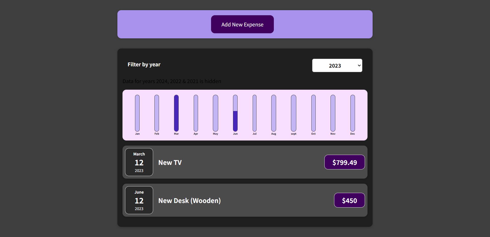
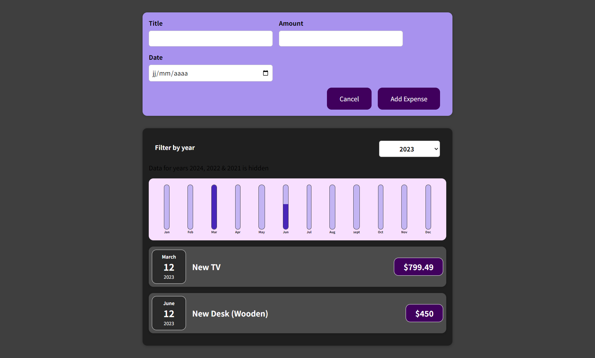

# Expense Tracker App

## Description

An easy-to-use expense tracker app to help you manage your finances and track your expenses effortlessly.

## Installation

To install the Expense Tracker App, follow these steps:

1. Clone the repository
2. Navigate to the project directory
3. Install dependencies: `npm install`
4. Start the app: `npm start`

## Screenshots/Demo

Upon launching the app, you'll see this interface :

After clicking on the Add New Expense button you will see:

## Features

- Record income and expenses, specifying the exact date.
- Filter expenses by year.
- clear, graphical representations of the amounts by year
- User-friendly interface.

## Technologies Used

- React.js

## Contributing

Contributions are welcome! 

## Contact Information

For questions or feedback, please contact fatmasliti289@gmail.com
